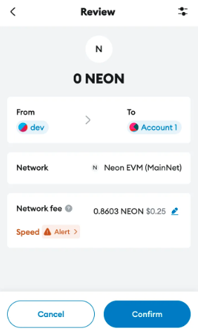
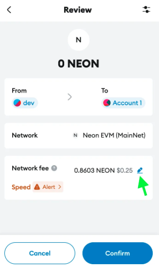
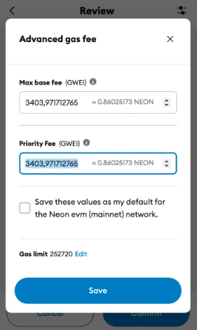

import Tabs from '@theme/Tabs';
import TabItem from '@theme/TabItem';

## Overview

EIP-1559 introduces a more predictable and efficient transaction fee mechanism. Neon EVM  supports EIP-1559, aligning its fee model with Ethereum’s ecosystem and improving the user experience.

## Key Features
### Base fee

- **Dynamic adjustment**: The base fee adjusts automatically based on network demand, increasing when blocks are more than 50% full and decreasing when they are less.
- **Burn mechanism**: The base fee is burned, reducing the total token supply and creating a deflationary effect.

### Priority fee (Tip)

- Users can include a tip to incentivize validators to prioritize their transactions.
- Higher tips can expedite transaction confirmation during periods of high network demand.

### Improved predictability

- The base fee mechanism minimizes gas price volatility, making transaction costs easier to estimate.

## Using MetaMask with EIP-1559
### Step-by-Step Guide

1. **Initiate a transaction**
    - Open your dApp or wallet and start a transaction (e.g., transferring tokens).
    - MetaMask will display a transaction prompt.

2. **Edit gas settings**
    - Click **Edit** or **Settings** to modify gas parameters.

3. **Set base fee and priority fee**
    - **Max fee**: The maximum amount per gas unit (Base Fee + Priority Fee).
    - **Priority fee (Tip)**: Optional fee to speed up transaction processing.

4. **Confirm and submit**
    - Save your settings and confirm the transaction.

5. **Monitor the transaction**
		    - Use MetaMask or a block explorer like [Neonscan](https://neonscan.io/) to track transaction status. Adjust the Priority Fee if necessary.
